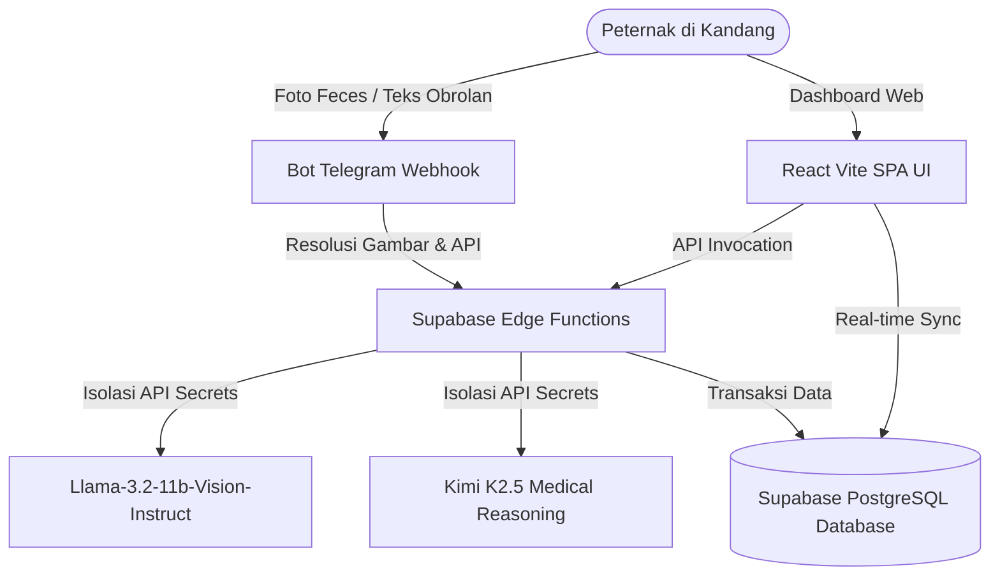

# SmartPoultry AI — Platform Manajemen Kandang Pintar & Diagnosa Vet AI

SmartPoultry adalah platform manajemen kandang ayam petelur (*laying hens*) modern berbasis kecerdasan buatan (AI). Sistem ini mengintegrasikan **Dashboard Web Real-time** dengan **Bot Telegram Multimodal** untuk pencatatan harian otomatis, kalkulasi FCR (Feed Conversion Ratio), analitik produksi, serta diagnosa penyakit visual otomatis menggunakan model AI vision tercanggih.

---

## 🏗️ Arsitektur Sistem

Aplikasi ini menggunakan pendekatan serverless modern dengan integrasi terisolasi:



---

## ⚡ Fitur Utama

1. **Dashboard Overview Real-time**: Memantau grafik FCR, total produksi harian, tingkat kematian (mortalitas), persediaan pakan gudang, dan status kandang.
2. **Klinik Vet AI (Pendeteksi Penyakit Visual)**:
   - **Formulir Web**: Checklist 14 gejala klinis spesifik lengkap dengan pengunggahan foto feces/kondisi ayam.
   - **Telegram Vision**: Kirim foto feces ayam Anda langsung ke bot, dan AI vision akan mendiagnosa nama penyakit, tingkat bahaya, deskripsi klinis, tindakan karantina, serta rekomendasi resep obat secara otomatis.
3. **Pencatatan Harian Cepat (Telegram Shortcut)**: Catat seluruh data kandang dalam 5 detik hanya dengan mengetik satu baris kode di Telegram.
4. **Analitik Tren & Prediksi Produksi**: Menampilkan data performa mingguan dan grafik tren 30 hari ke belakang.
5. **Ekspor Data Mudah**: Ekspor data laporan harian ke dalam format `.csv` instan melalui Telegram atau Dashboard.

---

## 🚀 Panduan Memulai (Menjalankan Lokal)

### Prasyarat
- Node.js (v18 ke atas)
- NPM atau PNPM

### Langkah 1: Kloning & Instalasi Dependensi
```bash
# Masuk ke folder smartpoultry
cd smartpoultry

# Instal seluruh dependensi
npm install
```

### Langkah 2: Konfigurasi Environment Variables
Buat berkas `.env` di direktori utama `smartpoultry/` dan masukkan kredensial Supabase Anda:
```env
VITE_SUPABASE_URL=https://bevffntecuhytfntkkny.supabase.co
VITE_SUPABASE_ANON_KEY=eyJhbGciOiJIUzI1NiIsInR5cCI6IkpXVCJ9...
```

### Langkah 3: Jalankan Server Pengembang
```bash
npm run dev
```
Aplikasi web Anda akan berjalan di `http://localhost:3000`.

---

## 🤖 Panduan Integrasi Bot Telegram & Kode Shortcut

### Langkah 1: Menghubungkan Akun
1. Buka **Dashboard Web SmartPoultry** -> Pergi ke **Pengaturan** -> **Integrasi Bot Telegram**.
2. Salin token integrasi unik Anda (contoh: `SP-XXXX-YYYY`).
3. Cari bot Telegram Anda di Telegram dan ketik perintah link berikut:
   ```text
   /link SP-XXXX-YYYY
   ```
4. Akun Anda berhasil terhubung! Anda sekarang dapat melakukan pencatatan dan tanya jawab.

### Langkah 2: Kamus Kode Shortcut Pencatatan Harian (Log Kandang)
Ketik kode dipisahkan dengan titik koma (`;`) di bot Telegram untuk mencatat data hari ini secara instan:

```text
TL 4300; TB 266; TR 5; PK 480; PS 12; AM 1; SH 30.5; FC normal; VT VitaStress; AB 09:00
```

**Penjelasan Kode:**
- `TL [angka]` : Jumlah telur utuh hari ini (butir) — **Wajib**
- `TB [angka]` : Berat total telur (kg) — **Wajib**
- `TR [angka]` : Jumlah telur rusak/BS (butir)
- `PK [angka]` : Konsumsi pakan keluar (kg) — **Wajib**
- `PS [angka]` : Sisa stok pakan gudang (kg)
- `AM [angka]` : Kematian ayam (ekor) — **Wajib**
- `SH [angka]` : Suhu siang kandang (°C) — **Wajib**
- `FC normal/basah` : Kondisi kotoran ayam — **Wajib**
- `VT [teks]` : Vitamin, vaksin, atau obat yang diberikan hari ini
- `AB [waktu]` : Jam pengambilan telur atau kebersihan kandang

### Perintah Cepat Lainnya:
- `/status` : Menampilkan ringkasan kondisi kandang hari ini dengan rangkuman dari AI.
- `/laporan 7` : Ringkasan performa 7 hari terakhir lengkap dengan analisis tren FCR dari AI.
- `/csv 30` : Mengunduh data 30 hari terakhir langsung sebagai berkas Excel/CSV di Telegram.
- `/notif [0-23]` : Mengatur jam pengiriman notifikasi insight otomatis harian Anda (contoh: `/notif 14` untuk jam 14:00 WIB).

---

## 🔒 Kebijakan Keamanan (Security Policy)
Aplikasi ini menerapkan **Row Level Security (RLS)** tingkat lanjut pada PostgreSQL Supabase. Pengguna hanya dapat membaca dan memodifikasi data milik profil terdaftar mereka sendiri. Kunci API eksternal (seperti Groq dan Bluesminds) disimpan dengan aman sebagai *Supabase Secrets* di server awan Deno Edge Functions, mencegah segala bentuk eksploitasi dan pembocoran data sensitif ke sisi klien (browser).
